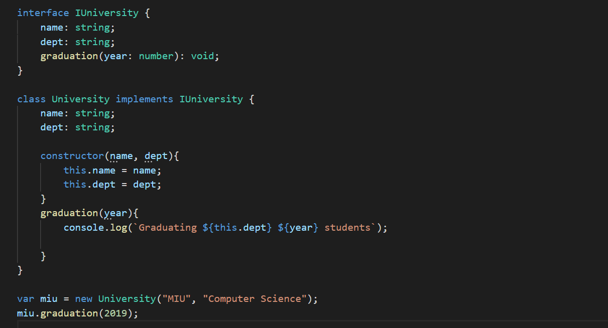
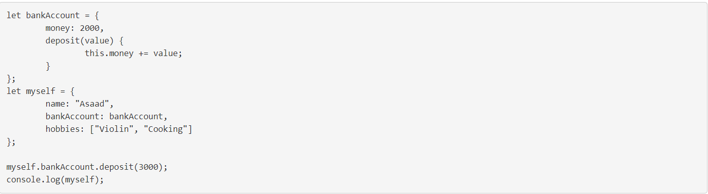
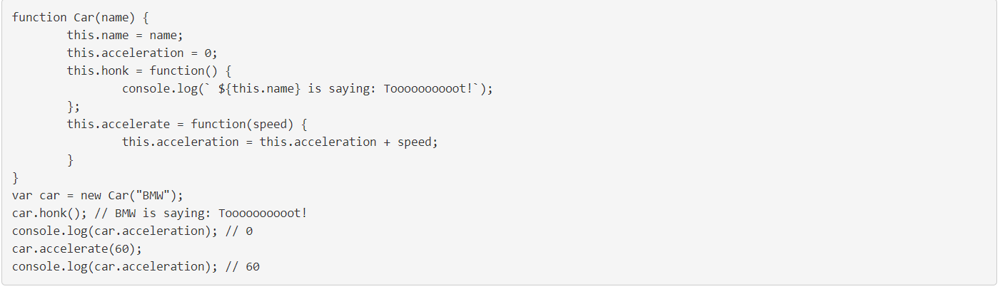
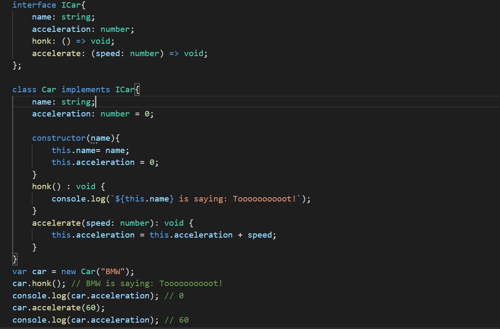
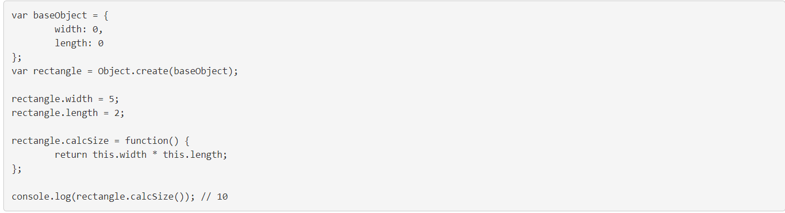
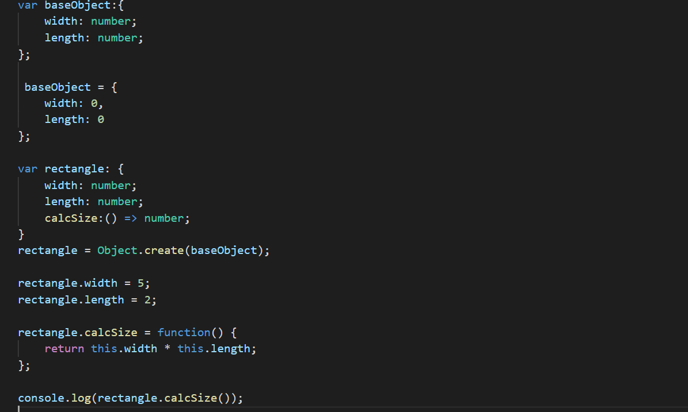

# This is Lab 3 assignment

### Exercise 1 Question

### Exercise 1 Answer

### Exercise 2 Question

### Exercise 2 Answer

### Exercise 3 Question

### Exercise 3 Answer

### Exercise 4 Question

### Exercise 4 Answer

